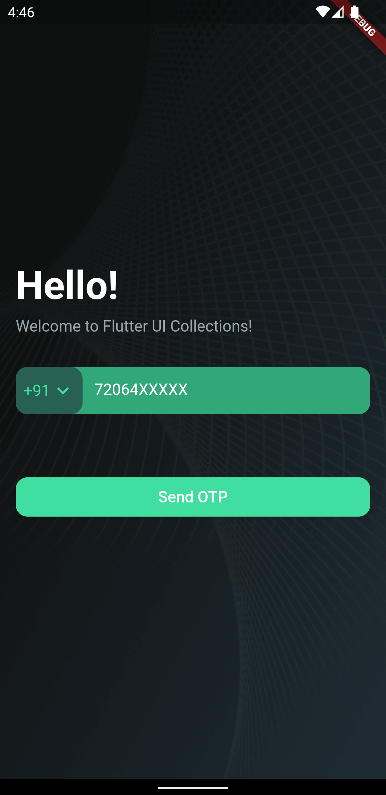
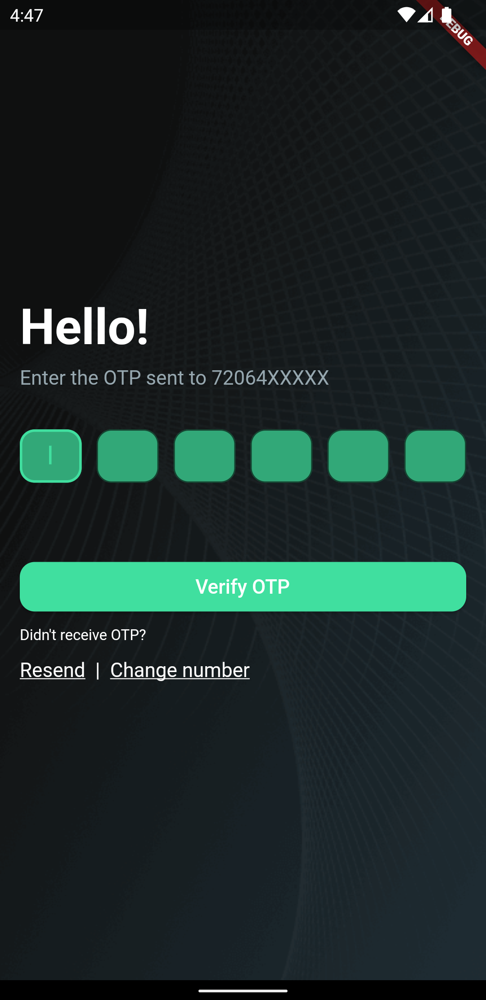
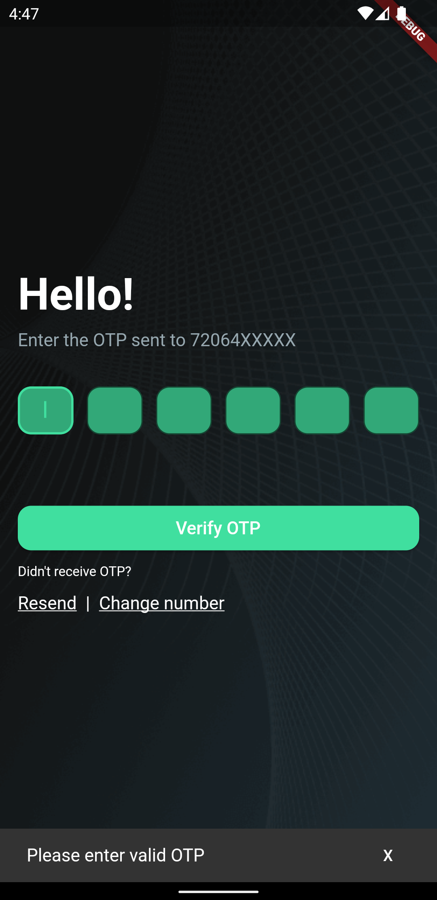

# flutter_ui_collections

Simple flutter UI samples such as Login, OTP Input, Tab bar, Custom Texts, Custom Colours etc with scalable folder structure.

## Getting Started

This project is a starting point for a Flutter application.

A few resources to get you started if this is your first Flutter project:

- [Lab: Write your first Flutter app](https://docs.flutter.dev/get-started/codelab)
- [Cookbook: Useful Flutter samples](https://docs.flutter.dev/cookbook)

For help getting started with Flutter development, view the
[online documentation](https://docs.flutter.dev/), which offers tutorials,
samples, guidance on mobile development, and a full API reference.

## Useful commands

Flutter setup: https://docs.flutter.dev/get-started/install/macos

1. To create a new flutter app `flutter create my_app`
2. To check missing dependencies `flutter doctor`
3. List emulators `$ANDROID_HOME/emulator/emulator -list-avds`
4. Start an emulator ` $ANDROID_HOME/emulator/emulator @1536_1024_device`
5. Check if devices are runnning `flutter devices`
6. Run app `flutter run`

## Naming conventions & Folder structure

1. https://www.geeksforgeeks.org/flutter-file-structure/
2. https://medium.com/flutter-community/scalable-folder-structure-for-flutter-applications-183746bdc320

## Tutorials

1. Classes & Objects in Dart: https://dart.academy/creating-objects-and-classes-in-dart-and-flutter/
2. Get started with Flutter: https://docs.flutter.dev/get-started/codelab
3. Flutter layouts: https://docs.flutter.dev/development/ui/layout

## Screenshots

<table>
  <tr>
    <td></td>
    <td></td>
  </tr>
  <tr>
    <td></td>
    <td></td>
  </tr>
</table>
